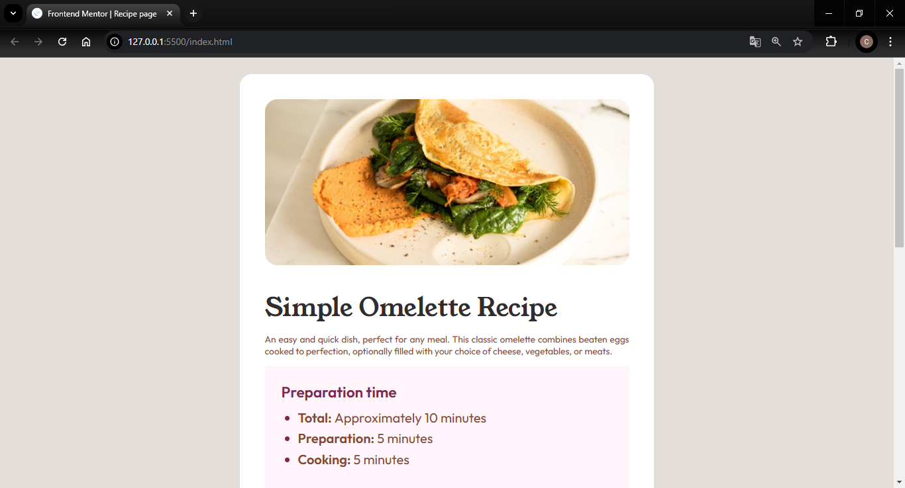
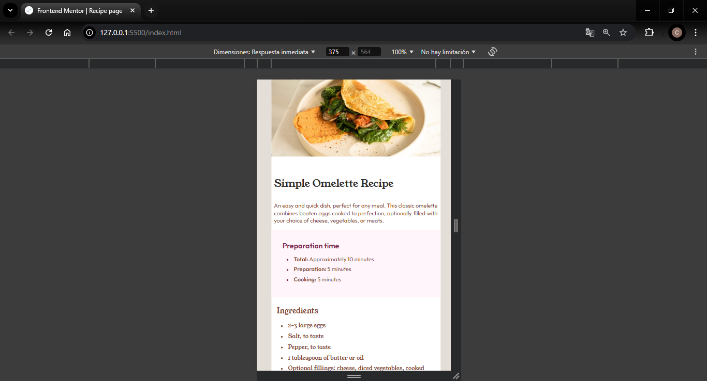

# Frontend Mentor - Recipe page solution

This is a solution to the [Recipe page challenge on Frontend Mentor](https://www.frontendmentor.io/challenges/recipe-page-KiTsR8QQKm). Frontend Mentor challenges help you improve your coding skills by building realistic projects. 

## Table of contents

- [Overview](#overview)
  - [The challenge](#the-challenge)
  - [Screenshot](#screenshot)
  - [Links](#links)
- [My process](#my-process)
  - [Built with](#built-with)
  - [What I learned](#what-i-learned)
  - [Continued development](#continued-development)
  - [Useful resources](#useful-resources)
- [Author](#author)

## Overview

### Screenshot

### Links

- Solution URL: [Add solution URL here](https://your-solution-url.com)
- Live Site URL: [Add live site URL here](https://your-live-site-url.com)

## My process

### Built with

- Semantic HTML5 markup
- CSS custom properties
- Flexbox

### What I learned

I learned more about using flexbox, however I would like to improve more in responsive design and CSS layout.

### Continued development

I want to continue improving my CSS page styling, learn more about using Flexbox and CSS Grid, and how to use responsive design properly.

### Useful resources

- [Flexbox](https://developer.mozilla.org/es/docs/Web/CSS/CSS_flexible_box_layout/Basic_concepts_of_flexbox) - It helped me understand some flexbox rules
- [Aprende CSS Flexbox](Aprendem) - It helped me better understand the usefulness of flexbox and how to apply it.

## Author

- GitHub - [@ChrisSolusNJ](https://github.com/ChrisSolusNJ)
- Frontend Mentor - [@ChrisSolusNJ](https://www.frontendmentor.io/profile/ChrisSolusNJ)
